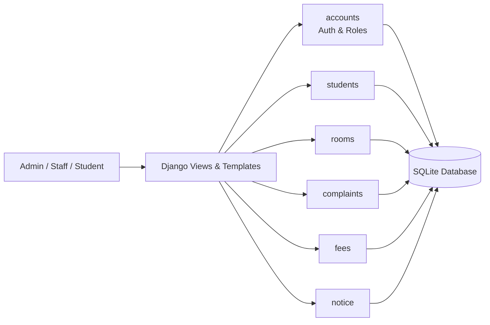

<div align="center">

# 🏨 Hostel Management System

**A full-stack Django web application that replaces paperwork and spreadsheets with one centralized dashboard for running a hostel.**


[Features](#-key-features) · [Screenshots](#-screenshots) · [Architecture](#-architecture) · [Quick Start](#-quick-start) · [Roadmap](#-roadmap) · [Author](#-author)

</div>

---

## 📌 The Problem

Hostel administration usually runs on registers, spreadsheets and WhatsApp messages. Room allocations get double-booked, complaints go unresolved, fee dues are hard to track, and notices don't reach everyone.

## 💡 The Solution

This system brings **students, rooms, complaints, fees and notices** into a single platform with **secure, role-based access**. Admins and staff manage operations, and students get self-service access to their own information.

---

## ✨ Key Features

| Module | What it does |
|---|---|
| 👤 **Student Management** | Register students, view profiles, and manage records |
| 🛏️ **Room Management** | Allocate and assign rooms, and track availability |
| 📝 **Complaint System** | Students raise complaints, and admins track them through to resolution |
| 💳 **Fee Management** | Track payments, due amounts and full payment history |
| 📢 **Notice Board** | Post and view hostel announcements |
| 🔐 **Authentication** | Secure login with role-based access (Admin, Staff, Student) |

### Who uses it and what they can do

| Role | Capabilities |
|---|---|
| **Admin** | Manages every module through the Django admin panel |
| **Staff** | Manages room allocations, resolves complaints, posts notices |
| **Student** | Views room details, raises complaints, checks fee status, reads notices |


## 🏗️ Architecture

The project follows Django's modular app structure, with one app per business domain, so each module can be developed and tested independently.



### Project Structure

```text
hostel-management-system/
├── accounts/             # Authentication & user management
├── students/             # Student profiles & records
├── rooms/                # Room allocation & availability
├── complaints/           # Complaint tracking system
├── fees/                 # Fee management & payments
├── notice/               # Notice board
├── hostel_management/    # Core settings & configuration
├── templates/            # Reusable HTML templates
├── media/                # Uploaded files (images, documents)
└── manage.py             # Django management script
```

---

## 🛠️ Tech Stack

| Layer | Technology |
|---|---|
| **Backend** | Python, Django |
| **Database** | SQLite (default) |
| **Frontend** | HTML, CSS, JavaScript |
| **Templating** | Django Templates |
| **Version Control** | Git & GitHub |

---

## 🚀 Quick Start

**1. Clone the repository**
```bash
git clone https://github.com/NANI381C/hostel-management-system.git
cd hostel-management-system
```

**2. Create and activate a virtual environment**
```bash
python3 -m venv .venv
source .venv/bin/activate        # macOS / Linux
# .venv\Scripts\activate         # Windows
```

**3. Install dependencies**
```bash
pip install -r requirements.txt
```

**4. Set up the database**
```bash
python manage.py makemigrations
python manage.py migrate
```

**5. Create an admin account**
```bash
python manage.py createsuperuser
```

**6. Run the server**
```bash
python manage.py runserver
```

Open **http://127.0.0.1:8000** for the app, or **http://127.0.0.1:8000/admin** for the admin panel.

> 🔒 No default credentials are included. You create your own admin account in step 5.

---

## 🧭 Usage

1. **Admin** logs in at `/admin` and sets up students, rooms and fee records.
2. **Staff** allocate rooms, resolve complaints and post notices.
3. **Students** log in to view their room, raise complaints, check fee status and read notices.

---

## 🧠 Skills Demonstrated

- Designing a **multi-module Django application** with separate apps for each domain
- **Authentication and role-based access control** for different user types
- Modelling relational data (students ↔ rooms ↔ fees ↔ complaints) with the **Django ORM**
- Building **CRUD workflows** end to end, from models and views to templates
- Structuring a project for **maintainability** and clean separation of concerns
- Working with **Git and GitHub** for version control

---

## 🗺️ Roadmap

- [ ] Payment gateway integration
- [ ] Email notifications for complaints and notices
- [ ] Mobile-responsive design
- [ ] Role-based dashboard with charts and analytics
- [ ] MySQL / PostgreSQL support
- [ ] REST API endpoints (Django REST Framework)

---

## 🤝 Contributing

Suggestions and improvements are welcome.

1. Fork the repository
2. Create a feature branch (`git checkout -b feature/your-feature`)
3. Commit your changes (`git commit -m "Add your feature"`)
4. Push to the branch and open a Pull Request

---

## 👨‍💻 Author

**Simham Nagasai**
Final-year B.E. (AI & ML) student

[](https://github.com/NANI381C)
[](https://www.linkedin.com/in/simham-nagasai-42851a2a7)
[](mailto:simhamnagasai0@gmail.com)

---

## 📄 License

This project is open source under the [MIT License](LICENSE).

<div align="center">

⭐ If you found this project useful, consider giving it a star.

</div>
